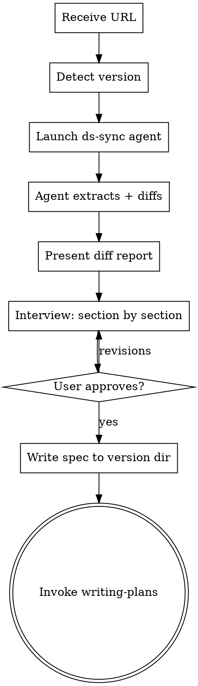

# Design System Sync

Sync an external design system into the codebase. Extracts every token from a URL, diffs against current SCSS foundation, walks through changes with the user, and produces an implementation spec.

All output is versioned under `docs/design/` — extraction, diff, spec, plan, and screenshots live together per version, similar to how conductor tracks work.

## Directory Structure

```
docs/design/
├── v1/
│   ├── extraction.md        # Full token extraction from URL
│   ├── diff-report.md       # Diff against codebase (+ previous version if exists)
│   ├── spec.md              # Approved implementation spec
│   ├── plan.md              # Phased implementation plan
│   ├── screenshots/         # Section screenshots from the design system
│   └── metadata.json        # URL, timestamp, token counts
├── v2/
│   └── ...                  # Next sync
└── latest -> v2/            # Symlink to most recent
```

## Process



## Steps

### 1. Detect Version

Scan `docs/design/` for existing `v*` directories. Next version = highest + 1. First sync = `v1`.

### 2. Launch Extraction Agent

Dispatch the **ds-sync** agent with:
- `url`: The design system URL from the user's argument
- `version`: Detected version (e.g., `v2`)
- `baseDir`: `docs/design/`

Wait for the agent to complete. It produces:
- `docs/design/{version}/extraction.md` — full token extraction
- `docs/design/{version}/diff-report.md` — diff against codebase (and previous version)
- `docs/design/{version}/screenshots/` — section screenshots
- `docs/design/{version}/metadata.json` — sync metadata

### 3. Present the Diff Report

Summarize the diff report for the user:
- Category summary table (new/changed/removed per category)
- Highlight breaking changes (renamed tokens, removed tokens, value shifts)
- Call out tokens with no equivalent in the design system
- If v2+, highlight what changed since last sync

### 4. Interview — Section by Section

Walk through each token category one at a time:
1. **Colors** — palette changes, new scales, naming convention
2. **Typography** — font families, size scale, weights, line heights
3. **Spacing** — grid system, scale values
4. **Radius** — new values, naming
5. **Shadows** — new definitions, naming
6. **Motion** — durations, easings, keyframes
7. **Z-Index** — stacking order
8. **Heights** — fixed component dimensions
9. **Breakpoints** — viewport values

For each section:
- Show what's changing (old → new)
- Ask about naming preferences (numbered scales, named tokens, etc.)
- Ask about migration strategy for existing usages
- Propose a token mapping and get approval

Only ask **one question per message**. Prefer multiple choice when possible.

### 5. Write Implementation Spec

Once all sections are approved, write the spec to `docs/design/{version}/spec.md` containing:
- All approved token definitions (with exact SCSS `:root` blocks)
- Token migration map (old name → new name for every token)
- File change list (which files need updates)
- Implementation phases
- Verification steps
- Risks and rollback plan

Commit the spec.

### 6. Transition

Invoke the **writing-plans** skill to create a phased implementation plan. Save the plan to `docs/design/{version}/plan.md`.

## Key Rules

- Never skip the interview. Every token change goes through the user.
- One question per message during the interview.
- The user's naming preferences override the design system's naming.
- If the design system has tokens not in the codebase, ask whether to add them.
- If the codebase has tokens not in the design system, ask whether to keep or remove them.
- All output goes in `docs/design/{version}/`, not scattered across the project.
- Screenshots go in `docs/design/{version}/screenshots/`, never the project root.
