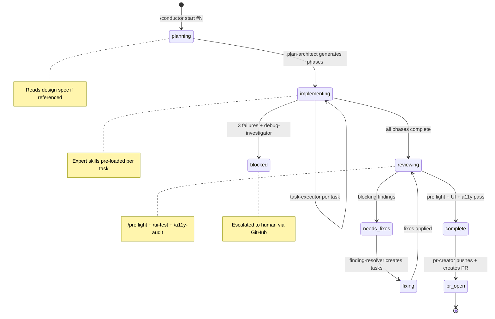

# Conductor Pipeline

State machine for the autonomous ticket-to-PR workflow.

```mermaid
stateDiagram-v2
    [*] --> planning: /conductor start #N
    planning --> implementing: plan-architect generates phases
    implementing --> reviewing: all phases complete
    reviewing --> complete: preflight + UI + a11y pass
    reviewing --> needs_fixes: blocking findings
    needs_fixes --> fixing: finding-resolver creates tasks
    fixing --> reviewing: fixes applied
    complete --> pr_open: pr-creator pushes + creates PR
    pr_open --> [*]

    implementing --> implementing: task-executor per task
    implementing --> blocked: 3 failures + debug-investigator

    note right of planning: Reads design spec if referenced
    note right of implementing: Expert skills pre-loaded per task
    note right of reviewing: /preflight + /ui-test + /a11y-audit
    note right of blocked: Escalated to human via GitHub
```
