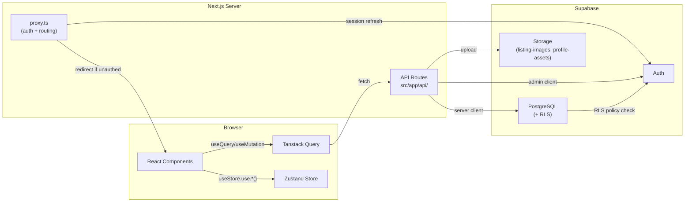

# Data Flow

How data moves between the browser, Next.js server, and Supabase.

```mermaid
flowchart LR
    subgraph CLIENT["Browser"]
        UI["React Components"]
        TQ["Tanstack Query"]
        ZS["Zustand Store"]
    end

    subgraph SERVER["Next.js Server"]
        API["API Routes<br/>src/app/api/"]
        PX["proxy.ts<br/>(auth + routing)"]
    end

    subgraph SUPABASE["Supabase"]
        AUTH["Auth"]
        DB["PostgreSQL<br/>(+ RLS)"]
        STOR["Storage<br/>(listing-images, profile-assets)"]
    end

    UI -->|"useQuery/useMutation"| TQ
    UI -->|"useStore.use.*()"| ZS
    TQ -->|"fetch"| API
    PX -->|"session refresh"| AUTH
    PX -->|"redirect if unauthed"| UI
    API -->|"server client"| DB
    API -->|"admin client"| AUTH
    API -->|"upload"| STOR
    DB -->|"RLS policy check"| AUTH
```
