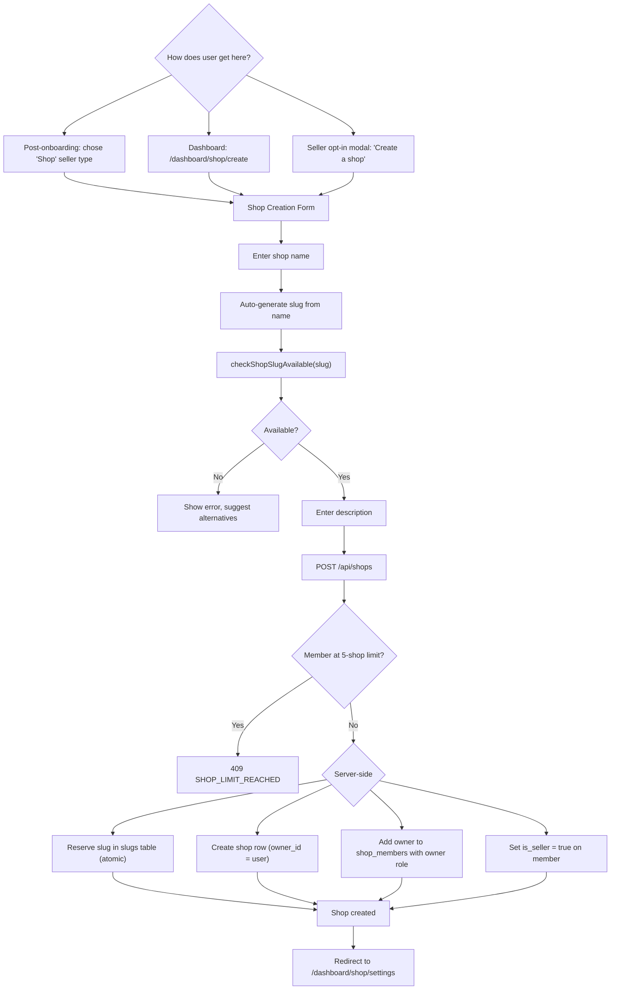
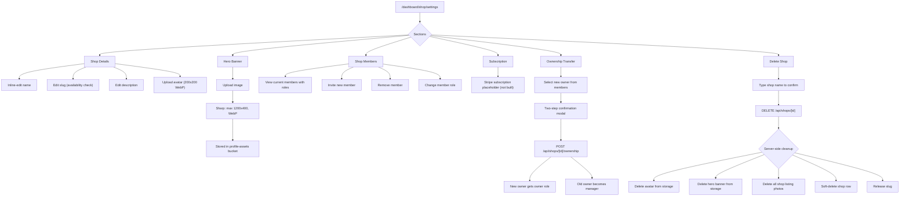
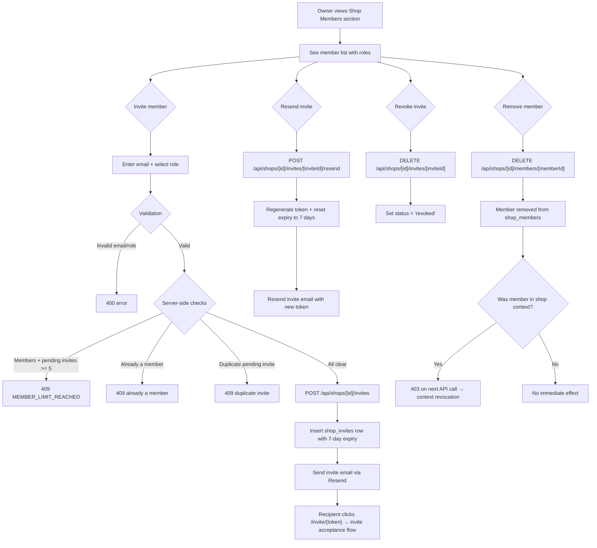
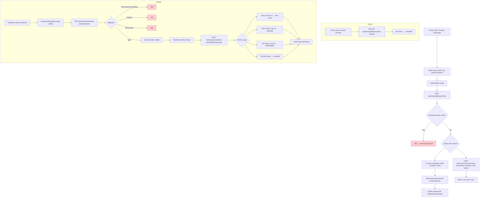
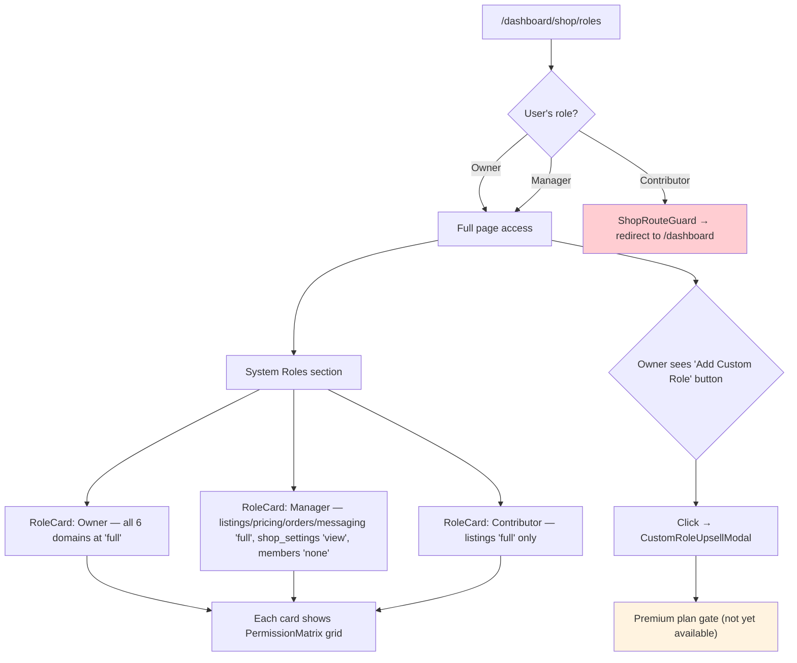
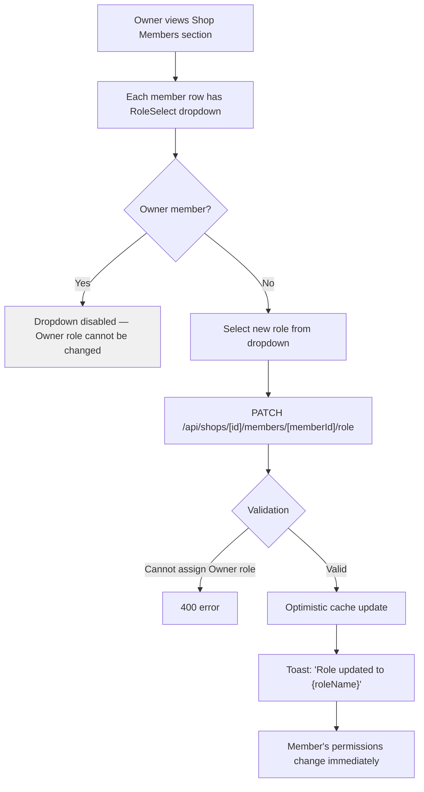

# Shop Owner Flows

Create shop, manage settings, invite members, roles & permissions, transfer ownership, delete shop.

## Create Shop

## Shop Settings

## Member Management

## Ownership Transfer (Request/Accept/Cancel)

## Roles & Permissions Page

## Role Assignment

