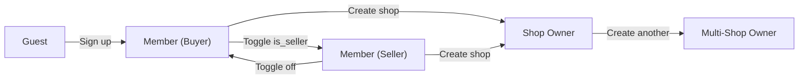
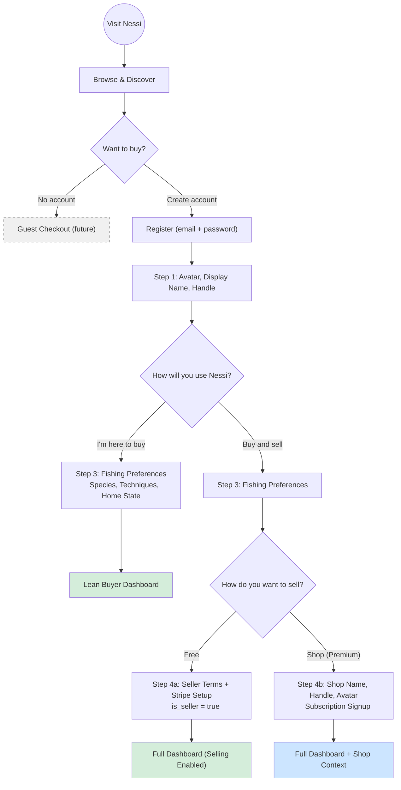
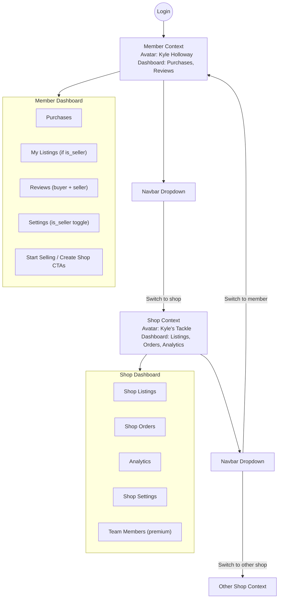
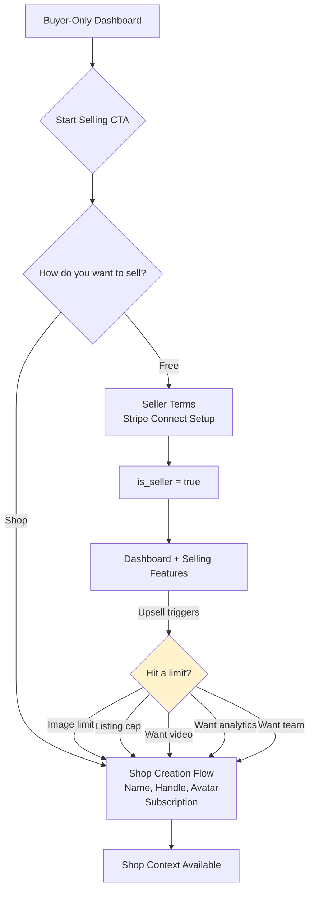
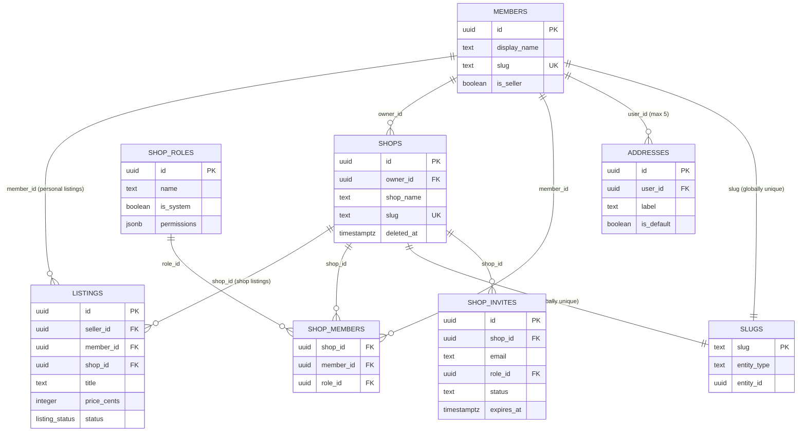
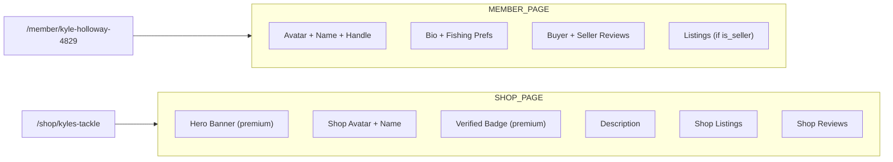
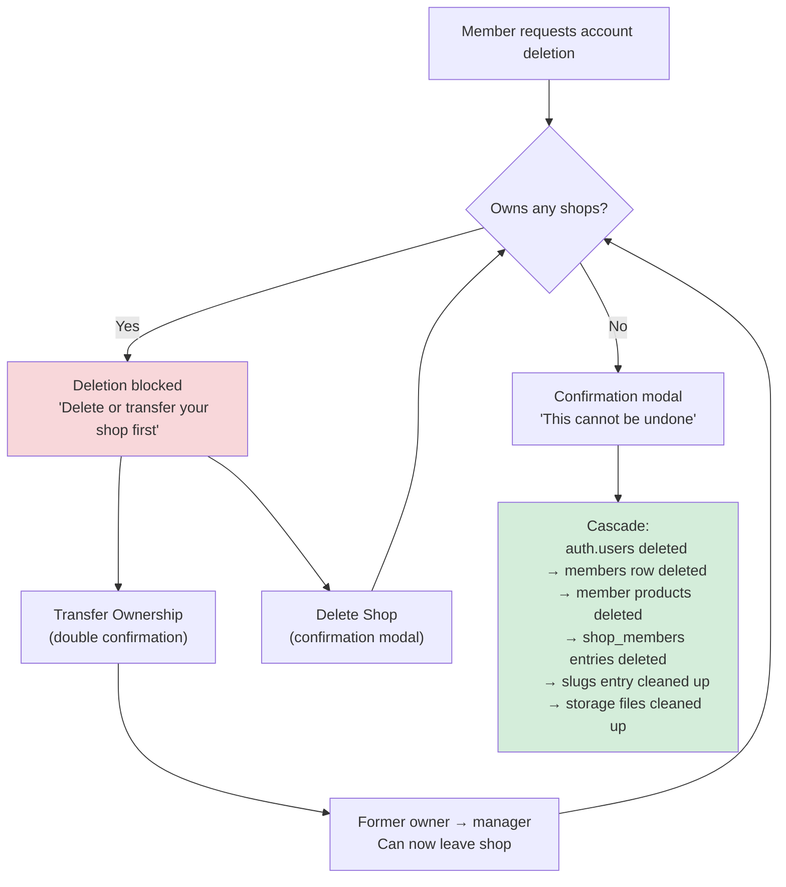
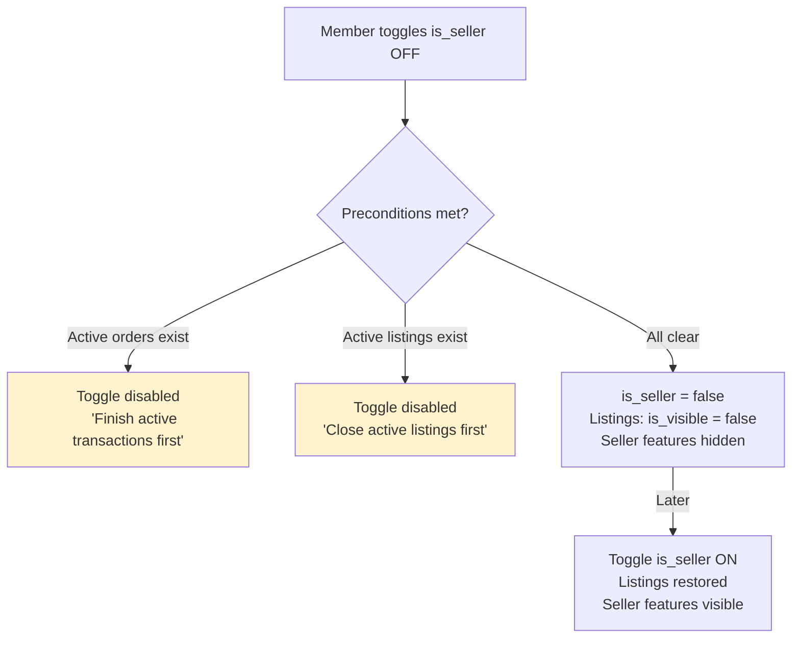

# Member & Shop User Journey

> **NOTE:** This is the original monolith journey diagram from early development. For current, maintained diagrams see [`docs/diagrams/journeys/`](journeys/README.md). This file is kept for historical reference.

Complete user journey covering guest checkout, member registration, buyer/seller paths, and shop creation.

## Account Tiers Overview

## Registration & Onboarding Flow

## Dashboard Context Switching

## Seller Opt-In (Post-Onboarding)

## Product Ownership Model

## Public Page Routing

## Account Deletion Flow

## is_seller Toggle Guards

