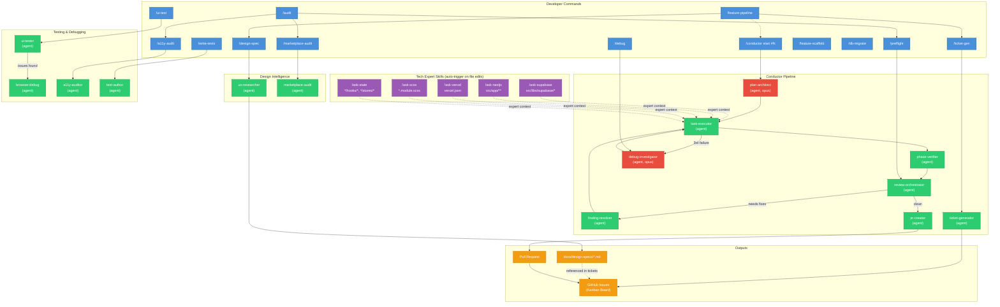

# Skill & Agent Pipeline

How developer commands flow through skills and agents to produce outputs.

```mermaid
flowchart TB
    subgraph USER["Developer Commands"]
        FP["/feature-pipeline"]
        DS["/design-spec"]
        TG["/ticket-gen"]
        CS["/conductor start #N"]
        PF["/preflight"]
        AU["/audit"]
        MA["/marketplace-audit"]
        A11Y["/a11y-audit"]
        UT["/ui-test"]
        FS["/feature-scaffold"]
        DM["/db-migrate"]
        WT["/write-tests"]
        DBG["/debug"]
    end

    subgraph EXPERTS["Tech Expert Skills (auto-trigger on file edits)"]
        ASK_SB["/ask-supabase<br/>src/libs/supabase/*"]
        ASK_NJ["/ask-nextjs<br/>src/app/**"]
        ASK_VC["/ask-vercel<br/>vercel.json"]
        ASK_SC["/ask-scss<br/>*.module.scss"]
        ASK_ST["/ask-state<br/>*/hooks/*, */stores/*"]
    end

    subgraph DESIGN["Design Intelligence"]
        UXR["ux-researcher<br/>(agent)"]
        MAA["marketplace-audit<br/>(agent)"]
    end

    subgraph CONDUCTOR["Conductor Pipeline"]
        PA["plan-architect<br/>(agent, opus)"]
        TE["task-executor<br/>(agent)"]
        PV["phase-verifier<br/>(agent)"]
        RO["review-orchestrator<br/>(agent)"]
        FR["finding-resolver<br/>(agent)"]
        DI["debug-investigator<br/>(agent, opus)"]
        PR["pr-creator<br/>(agent)"]
        TGN["ticket-generator<br/>(agent)"]
    end

    subgraph TESTING["Testing & Debugging"]
        UIT["ui-tester<br/>(agent)"]
        BD["browser-debug<br/>(agent)"]
        A11A["a11y-auditor<br/>(agent)"]
        TAU["test-author<br/>(agent)"]
    end

    subgraph OUTPUTS["Outputs"]
        SPEC["docs/design-specs/*.md"]
        ISSUES["GitHub Issues<br/>(Kanban Board)"]
        PROUT["Pull Request"]
    end

    %% Feature Pipeline flow
    FP --> DS
    FP --> TG
    FP -.-> CS

    %% Design flow
    DS --> UXR
    UXR --> SPEC

    %% Ticket flow
    TG --> TGN
    TGN --> ISSUES
    SPEC -.->|"referenced in tickets"| ISSUES

    %% Conductor flow
    CS --> PA
    PA --> TE
    TE --> PV
    PV --> RO
    RO -->|"clean"| PR
    RO -->|"needs fixes"| FR
    FR --> TE
    TE -->|"3rd failure"| DI
    DI --> TE
    PR --> PROUT
    PROUT --> ISSUES

    %% Expert pre-loading
    ASK_SB -.->|"expert context"| TE
    ASK_NJ -.->|"expert context"| TE
    ASK_VC -.->|"expert context"| TE
    ASK_SC -.->|"expert context"| TE
    ASK_ST -.->|"expert context"| TE

    %% Quality gates
    PF --> RO
    AU --> PF
    AU --> MA
    AU --> A11Y
    MA --> MAA
    A11Y --> A11A
    UT --> UIT
    UIT -->|"issues found"| BD

    %% Dev tools
    WT --> TAU
    DBG --> DI

    %% Styling
    classDef skill fill:#4A90D9,stroke:#2C5F8A,color:#fff
    classDef agent fill:#2ECC71,stroke:#1A9B54,color:#fff
    classDef opus fill:#E74C3C,stroke:#C0392B,color:#fff
    classDef output fill:#F39C12,stroke:#D68910,color:#fff
    classDef expert fill:#9B59B6,stroke:#7D3C98,color:#fff

    class FP,DS,TG,CS,PF,AU,MA,A11Y,UT,FS,DM,WT,DBG skill
    class UXR,MAA,TE,PV,RO,FR,PR,TGN,UIT,BD,A11A,TAU agent
    class PA,DI opus
    class SPEC,ISSUES,PROUT output
    class ASK_SB,ASK_NJ,ASK_VC,ASK_SC,ASK_ST expert
```
