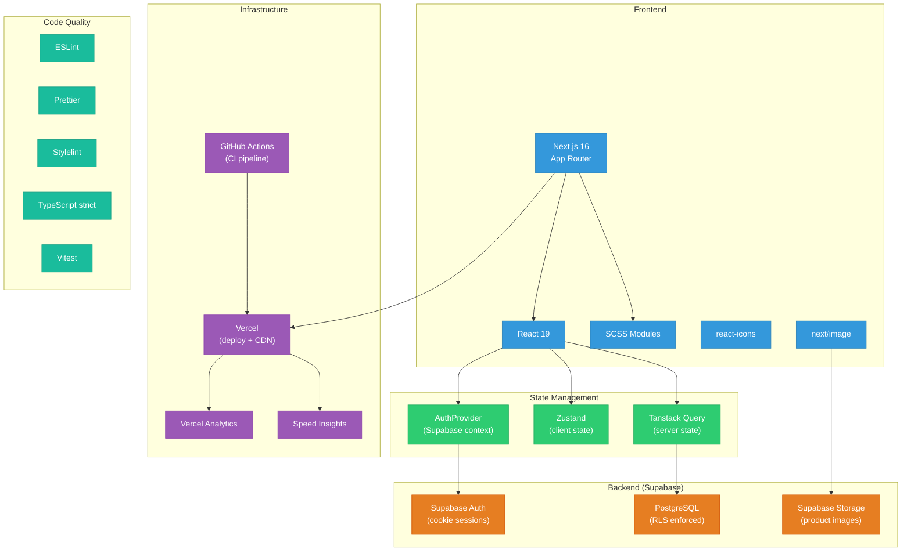

# Tech Stack

Nessi's technology layers and how they connect.

```mermaid
graph TB
    subgraph FRONTEND["Frontend"]
        NJ["Next.js 16<br/>App Router"]
        R19["React 19"]
        SCSS["SCSS Modules"]
        RI["react-icons"]
        NI["next/image"]
    end

    subgraph STATE["State Management"]
        TQ["Tanstack Query<br/>(server state)"]
        ZS["Zustand<br/>(client state)"]
        AC["AuthProvider<br/>(Supabase context)"]
    end

    subgraph BACKEND["Backend (Supabase)"]
        SA["Supabase Auth<br/>(cookie sessions)"]
        SP["PostgreSQL<br/>(RLS enforced)"]
        SS["Supabase Storage<br/>(product images)"]
    end

    subgraph INFRA["Infrastructure"]
        VC["Vercel<br/>(deploy + CDN)"]
        GA["GitHub Actions<br/>(CI pipeline)"]
        VA["Vercel Analytics"]
        VS["Speed Insights"]
    end

    subgraph QUALITY["Code Quality"]
        ES["ESLint"]
        PR["Prettier"]
        SL["Stylelint"]
        TS["TypeScript strict"]
        VT["Vitest"]
    end

    NJ --> R19
    NJ --> SCSS
    R19 --> TQ
    R19 --> ZS
    R19 --> AC
    AC --> SA
    TQ --> SP
    NI --> SS
    NJ --> VC
    GA --> VC
    VC --> VA
    VC --> VS

    classDef frontend fill:#3498DB,stroke:#2980B9,color:#fff
    classDef state fill:#2ECC71,stroke:#27AE60,color:#fff
    classDef backend fill:#E67E22,stroke:#D35400,color:#fff
    classDef infra fill:#9B59B6,stroke:#8E44AD,color:#fff
    classDef quality fill:#1ABC9C,stroke:#16A085,color:#fff

    class NJ,R19,SCSS,RI,NI frontend
    class TQ,ZS,AC state
    class SA,SP,SS backend
    class VC,GA,VA,VS infra
    class ES,PR,SL,TS,VT quality
```
